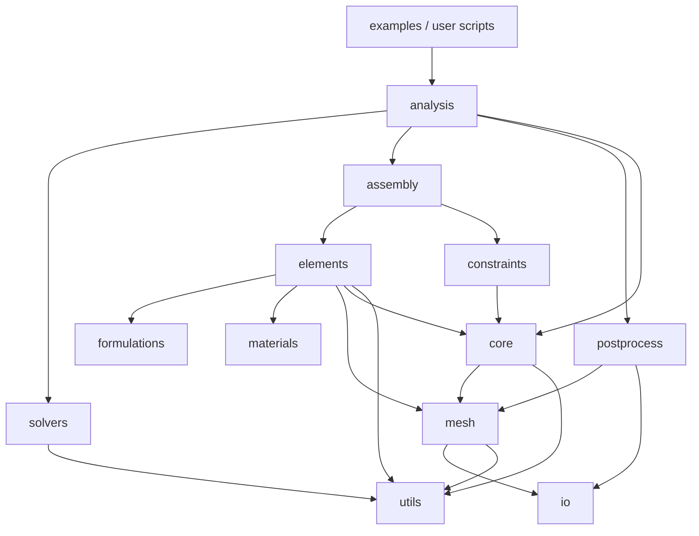
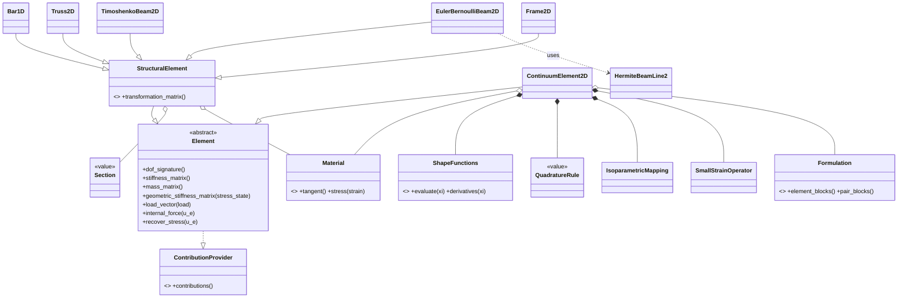
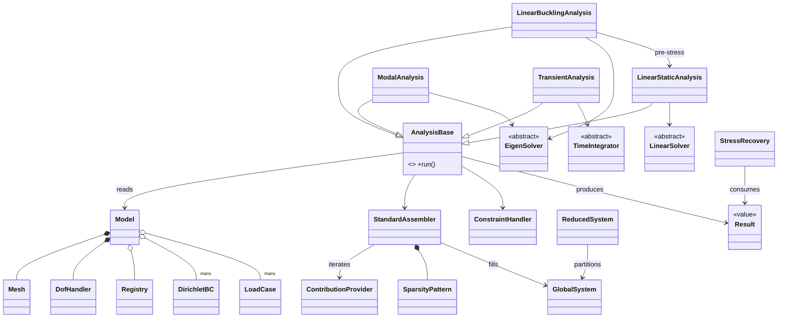

# NanoFEM — Software Architecture & Engineering Blueprint

**Document status:** Stage-1 design deliverable (architecture only, no implementation)
**Working package name:** `nanofem` — a placeholder. Check PyPI/GitHub availability before first release and record the final choice as ADR-000.
**Quality reference points:** FEniCS, deal.II, Code_Aster — adjusted for a pure-Python, research-scale scope.

---

## Guiding principles

These five principles resolve every design dispute in this document. When in doubt, apply them in order.

**P1 — Single responsibility, enforced by package boundaries.** Every package owns exactly one concern and has an explicit "must not do" list (§3). A class that needs two sentences to describe its job is two classes.

**P2 — Physics are strategies, not subclasses.** Materials, formulations, quadrature rules, solvers, and time integrators are injected objects behind abstract interfaces. Adding nonlocal elasticity later must mean *adding classes*, never *editing the element tree*.

**P3 — Design today for the hardest known future requirement.** That requirement is Eringen's *integral* nonlocal elasticity, whose stiffness couples spatially distant elements. It dictates the single most important decision in this architecture: **assembly is contribution-based, not element-based** (§1.3, Decision D1).

**P4 — Verification is a feature.** No element or formulation is merged without an automated test against a closed-form solution. The test suite *is* the scientific credibility of the package.

**P5 — Thin edges.** Heavy or optional dependencies (`gmsh`, `pyvista`, `meshio`) are quarantined in adapter modules at the boundary of the package. The physics core imports only `numpy` and `scipy`.

---

## 1. Overall software architecture

### 1.1 Architectural style

A strictly **layered architecture** with a downward-only dependency rule, combined with **strategy-pattern injection** for all physics and numerics. Higher layers orchestrate; lower layers compute; no layer imports upward.

```
┌──────────────────────────────────────────────────────────────────┐
│  APPLICATION LAYER                                               │
│  user scripts · examples/ · benchmarks/ · future CLI             │
├──────────────────────────────────────────────────────────────────┤
│  ANALYSIS LAYER          analysis/                               │
│  orchestration of static, modal, buckling, transient runs        │
├───────────────────────────┬──────────────────────────────────────┤
│  SOLUTION LAYER           │  RESULTS LAYER                       │
│  solvers/                 │  postprocess/                        │
│  linear · eigen · time    │  recovery · sampling · plots · VTK   │
├───────────────────────────┴──────────────────────────────────────┤
│  SYSTEM LAYER             assembly/                              │
│  sparsity · global K,M,Kg,f · contribution protocol              │
├──────────────────────────────────────────────────────────────────┤
│  DISCRETIZATION LAYER     elements/ · formulations/ · constraints/│
│  interpolation · quadrature · element matrices · BCs · loads     │
├──────────────────────────────────────────────────────────────────┤
│  MODEL LAYER              core/ · mesh/ · materials/             │
│  Model facade · DofHandler · Mesh · constitutive laws · sections │
├──────────────────────────────────────────────────────────────────┤
│  FOUNDATION LAYER         utils/ · io/                           │
│  exceptions · logging · validation · scaling · meshio adapters   │
└──────────────────────────────────────────────────────────────────┘
```

**Dependency rule.** A package may import from packages in the same layer or below, never above. `io/` is a lateral edge: it depends on `mesh/` and `postprocess/` data structures but nothing in the physics core imports `io/`. `utils/` imports nothing internal.

### 1.2 Design patterns and where they are used

| Pattern | Where | Why |
|---|---|---|
| Strategy | `Material`, `Formulation`, `QuadratureRule`, `LinearSolver`, `EigenSolver`, `TimeIntegrator` | Swap physics/numerics without touching consumers |
| Template Method | `AnalysisBase` (setup → assemble → constrain → solve → finalize) | All analyses share a skeleton; steps specialize |
| Facade | `Model` | One coherent entry point for mesh + materials + BCs + loads |
| Abstract Factory / Registry | `Registry` (string key → class) | Config-driven model building; third-party plugin elements |
| Protocol (structural typing) | `ContributionProvider` | Anything that can yield (row dofs, col dofs, dense block) can be assembled — the nonlocal enabler |
| Adapter | `io/meshio_adapter`, `mesh/gmsh_builder`, `postprocess/pyvista_view` | Quarantine external libraries (P5) |
| Builder | `GmshGeometryBuilder` | Stepwise parametric geometry → mesh construction |
| Value Object (dataclasses) | `Node`, `QuadratureRule`, `BeamSection2D`, result containers | Immutability, hashability, cheap testing |

### 1.3 The three load-bearing decisions

**D1 — Contribution-based assembly.** The assembler does not loop over elements; it loops over *contribution providers*. A provider yields triplets `(row_dofs, col_dofs, dense_block)`. A classical element yields exactly one square block (its own DOFs). A future *nonlocal integral* formulation yields one block per element **pair** `(e, e′)` within the attenuation horizon, producing off-diagonal coupling between non-adjacent elements. Retrofitting this into an element-loop assembler later would be a rewrite; adopting it now costs nothing. This is ADR-001.

**D2 — Element = geometry + interpolation; physics live in `Formulation` and `Material`.** Continuum elements are thin compositions of (cell shape functions, quadrature, kinematic operator, material). Nonlocal and strain-gradient elasticity arrive as new `Formulation` strategies and new `Material`/kernel classes — the element zoo does not grow combinatorially. Structural elements (bar, beams, truss, frame) are a pragmatic exception: their matrices are classical closed forms, so each is a self-contained class behind the *same* `Element` interface (honest hybrid, documented in ADR-002).

**D3 — Generalized DOF handling from day one.** The `DofHandler` treats every nodal unknown as a *(field, component)* pair, with per-node variable DOF counts. Rotational DOFs for beams/frames need this immediately; Hermite (C¹) interpolation for Euler–Bernoulli beams needs derivative DOFs immediately; strain-gradient elasticity will need the very same machinery later. Nothing in the codebase may assume "n DOFs per node, uniform."

### 1.4 Deliberate non-goals (recorded so scope creep is a decision, not an accident)

3-D solid elements, contact, material nonlinearity/plasticity, distributed-memory parallelism, and GUI are out of scope. The solver abstraction (§4, `solvers/`) is the door through which HPC backends could later enter without disturbing anything above it.

---

## 2. Folder hierarchy

```
nanofem/
├── pyproject.toml                  # single source of build/metadata/tooling config
├── README.md
├── LICENSE                         # recommend BSD-3-Clause or MIT for research adoption
├── CITATION.cff
├── CHANGELOG.md                    # Keep-a-Changelog format
├── CONTRIBUTING.md
├── .pre-commit-config.yaml
├── .github/
│   └── workflows/
│       ├── ci.yml                  # lint + typecheck + tests, matrix over Python versions
│       ├── docs.yml                # build & deploy documentation
│       └── release.yml             # tag-triggered build & publish
├── docs/
│   └── source/
│       ├── tutorials/              # learning-oriented, runnable end-to-end
│       ├── howto/                  # task-oriented recipes
│       ├── theory/                 # one chapter per formulation, with references
│       ├── api/                    # autodoc reference
│       └── adr/                    # Architecture Decision Records (ADR-000, 001, …)
├── examples/                       # curated demonstration scripts (rendered by sphinx-gallery)
├── benchmarks/                     # timing & scaling studies, kept out of the test suite
├── tests/
│   ├── unit/                       # math kernels, one module per source module
│   ├── element/                    # symmetry, rigid-body modes, patch tests, locking sweeps
│   ├── verification/               # vs. closed-form solutions (the scientific gate)
│   ├── convergence/                # h-refinement rate checks
│   └── regression/                 # frozen reference outputs
└── src/
    └── nanofem/
        ├── __init__.py             # curated public API re-exports only
        ├── core/
        │   ├── model.py            # Model facade
        │   ├── dof_handler.py      # DofHandler
        │   ├── fields.py           # FieldSpec, component definitions
        │   └── registry.py         # Registry (plugin/factory)
        ├── mesh/
        │   ├── node.py
        │   ├── mesh.py             # Mesh, CellBlock, regions/tags
        │   ├── readers.py          # thin wrapper over io adapters
        │   ├── gmsh_builder.py     # GmshGeometryBuilder (lazy gmsh import)
        │   ├── neighbor_search.py  # KD-tree horizon queries (nonlocal-ready)
        │   └── quality.py          # Jacobian/aspect-ratio checks
        ├── elements/
        │   ├── base.py             # Element, StructuralElement ABCs, ElementDofSignature
        │   ├── mapping.py          # IsoparametricMapping
        │   ├── kinematics.py       # SmallStrainOperator (B-matrix builder)
        │   ├── interpolation/
        │   │   ├── base.py         # ShapeFunctions ABC
        │   │   ├── lagrange.py     # line/tri/quad Lagrange families
        │   │   └── hermite.py      # C¹ cubic Hermite (EB beams now, strain gradient later)
        │   ├── quadrature/
        │   │   ├── rules.py        # QuadratureRule value object, Gauss families
        │   │   └── factory.py      # rule selection by cell type & requested order
        │   ├── structural/
        │   │   ├── sections.py     # BarSection, BeamSection2D
        │   │   ├── bar.py          # Bar1D
        │   │   ├── truss.py        # Truss2D
        │   │   ├── beam_eb.py      # EulerBernoulliBeam2D
        │   │   ├── beam_timoshenko.py
        │   │   └── frame.py        # Frame2D
        │   └── continuum/
        │       └── continuum2d.py  # ContinuumElement2D (composition-based)
        ├── materials/
        │   ├── base.py             # Material ABC
        │   ├── elastic.py          # LinearElastic1D, IsotropicElastic
        │   ├── plane.py            # PlaneStressElastic, PlaneStrainElastic
        │   └── orthotropic.py      # OrthotropicPlaneElastic (auxetic homogenization target)
        ├── formulations/
        │   ├── base.py             # Formulation ABC
        │   └── local_elasticity.py # LocalSmallStrain (phase ≤3 default)
        ├── constraints/
        │   ├── dirichlet.py        # DirichletBC
        │   ├── loads.py            # NodalLoad, LineLoad, TractionLoad, BodyForce
        │   ├── load_case.py        # LoadCase
        │   ├── time_functions.py   # TimeFunction family
        │   ├── mpc.py              # MultiPointConstraint (PeriodicBC lands here later)
        │   └── handler.py          # ConstraintHandler (DOF partitioning)
        ├── assembly/
        │   ├── contributions.py    # ContributionProvider protocol
        │   ├── sparsity.py         # SparsityPattern
        │   ├── assembler.py        # StandardAssembler
        │   └── system.py           # GlobalSystem, ReducedSystem
        ├── solvers/
        │   ├── linear.py           # LinearSolver ABC, SparseDirectSolver, ConjugateGradientSolver
        │   ├── eigen.py            # ShiftInvertEigensolver, BucklingEigensolver
        │   └── time_integration.py # TimeIntegrator ABC, NewmarkBeta
        ├── analysis/
        │   ├── base.py             # AnalysisBase (template method)
        │   ├── static.py           # LinearStaticAnalysis
        │   ├── modal.py            # ModalAnalysis
        │   ├── buckling.py         # LinearBucklingAnalysis
        │   ├── transient.py        # TransientAnalysis
        │   └── results.py          # StaticResult, ModalResult, BucklingResult, TransientResult
        ├── postprocess/
        │   ├── recovery.py         # StressRecovery (Gauss → nodal)
        │   ├── sampling.py         # FieldSampler (probe lines/points)
        │   ├── diagrams.py         # BeamDiagramExtractor (N, V, M along members)
        │   ├── export.py           # VTKExporter, TimeSeriesWriter (XDMF)
        │   ├── plotting.py         # matplotlib figures (convergence, modes, diagrams)
        │   └── pyvista_view.py     # PyVistaScene (lazy pyvista import)
        ├── io/
        │   ├── meshio_adapter.py   # meshio ↔ Mesh conversion (both directions)
        │   └── writers.py          # ResultWriter dispatch
        └── utils/
            ├── exceptions.py       # full exception hierarchy (§9)
            ├── logging.py          # get_logger, configuration
            ├── validation.py       # require_positive, require_shape, …
            ├── scaling.py          # Nondimensionalizer (critical at nm scale, §13)
            └── rotations.py        # 2D transformation matrices
```

The **src layout** is deliberate: tests run against the *installed* package, catching packaging errors that flat layouts hide.

---

## 3. Responsibility of every folder

| Package | Owns (single responsibility) | Must NOT do |
|---|---|---|
| `core/` | The model facade, DOF bookkeeping, field definitions, and the class registry | Compute any matrix; touch files; know element internals |
| `mesh/` | Geometry & topology: nodes, connectivity, regions, neighbor queries, quality | Know about DOFs, materials, or physics |
| `elements/` | Everything between reference cell and element matrices: interpolation, quadrature, mapping, kinematic operators, concrete elements | Assemble globally; apply BCs; solve |
| `materials/` | Pointwise constitutive response and cross-section property containers | Interpolate, integrate, or know mesh topology |
| `formulations/` | The weak form: how kinematics + constitution combine into integrands | Own DOF numbering or global storage |
| `constraints/` | Dirichlet/Neumann data, multipoint constraints, load cases, time functions, DOF partitioning | Modify global matrices directly (it *describes*; assembly/solvers *apply*) |
| `assembly/` | Scatter of local contributions into global sparse operators; sparsity; reduced systems | Decide physics; pick solvers |
| `solvers/` | Numerical linear algebra: linear solves, eigenproblems, time stepping | Know what the matrices *mean* physically |
| `analysis/` | Orchestration: wire model → assembler → constraints → solver → results for one analysis type | Contain numerical kernels or physics formulas |
| `postprocess/` | Derived quantities (stress recovery, diagrams), sampling, export, visualization | Mutate the model or solution |
| `io/` | Conversion between external formats (meshio, VTK/XDMF) and internal data structures | Contain physics; be imported by the physics core |
| `utils/` | Exceptions, logging, validation, nondimensional scaling, small math helpers | Import anything else in the package |
| `tests/` | Prove correctness at unit, element, verification, convergence, regression levels | Depend on private internals when a public path exists |
| `docs/` | Tutorials, how-tos, theory manual, API reference, ADRs | Drift from code (CI builds docs on every PR) |
| `examples/` | Show idiomatic usage; double as smoke tests via sphinx-gallery | Contain functionality unavailable in the library |
| `benchmarks/` | Performance tracking over time | Gate CI (informational only) |

---

## 4. Responsibility of every class

Legend: **A** = abstract base class, **C** = concrete, **V** = value object (frozen dataclass), **P** = protocol. Classes marked *(future)* are named now so interfaces can anticipate them, but are not built in stage 1.

### 4.1 `core/`

| Class | Kind | Single responsibility |
|---|---|---|
| `Model` | C | Facade: hold mesh, element sets, materials, sections, constraints, load cases; validate completeness before analysis; expose everything an `Analysis` needs |
| `DofHandler` | C | Map (node, field, component) → global equation number; report per-element DOF index arrays; expose free/constrained partitions supplied by `ConstraintHandler` |
| `FieldSpec` | V | Declare a physical field and its components (e.g. displacement → `ux, uy`; rotation → `rz`) |
| `Registry` | C | String-keyed registration and lookup of element, material, and solver classes; the plugin mechanism for third-party extensions |

### 4.2 `mesh/`

| Class | Kind | Single responsibility |
|---|---|---|
| `Node` | V | Identity and coordinates of one node |
| `CellBlock` | V | Homogeneous connectivity array for one cell type plus its region tag |
| `Mesh` | C | Container and query interface for nodes, cell blocks, and named regions (physical groups) |
| `MeshImporter` | C | Load a `Mesh` from disk via the `io/` meshio adapter |
| `GmshGeometryBuilder` | C | Programmatic parametric geometry → meshed `Mesh` through the gmsh Python API (lazy import) |
| `NeighborSearch` | C | KD-tree (scipy.spatial) queries: element centroids/nodes within a radius — the horizon query nonlocal assembly will need |
| `MeshQualityChecker` | C | Detect inverted/degenerate cells, aspect-ratio outliers; emit warnings with element IDs |

### 4.3 `elements/`

| Class | Kind | Single responsibility |
|---|---|---|
| `Element` | A | Contract every element honors: DOF signature, stiffness, mass, geometric stiffness, consistent load vector, internal force for a given state, stress/strain recovery at natural points |
| `ElementDofSignature` | V | Declare which (field, component) unknowns this element attaches to each of its nodes |
| `StructuralElement` | A | Extend `Element` with a local→global transformation matrix and a `Section` reference |
| `ShapeFunctions` | A | Evaluate N and its natural-coordinate derivatives on a reference cell |
| `LagrangeLine2/3`, `LagrangeTri3/6`, `LagrangeQuad4/8` | C | C⁰ Lagrange families per cell type |
| `HermiteBeamLine2` | C | C¹ cubic Hermite interpolation (Euler–Bernoulli now; strain-gradient continuity later) |
| `QuadratureRule` | V | Points and weights on a reference cell, with its exactness order |
| `QuadratureFactory` | C | Select a rule from (cell type, requested polynomial order) — including *reduced* rules for locking control |
| `IsoparametricMapping` | C | Jacobian, its determinant/inverse, and physical shape-function gradients at quadrature points |
| `SmallStrainOperator` | C | Build the strain–displacement B matrix from physical gradients (the seam where a gradient-enhanced operator plugs in later) |
| `BarSection`, `BeamSection2D` | V | Cross-section property containers (A; A, I, shear correction κ) — deliberately separate from `Material` |
| `Bar1D` | C | Axial two-node element: closed-form matrices |
| `Truss2D` | C | Bar in the plane with rotation transformation |
| `EulerBernoulliBeam2D` | C | Hermite bending element; exact for nodal loads |
| `TimoshenkoBeam2D` | C | Shear-deformable beam with locking-safe integration policy |
| `Frame2D` | C | Axial + bending superposition, 3 DOF/node, member releases later |
| `ContinuumElement2D` | C | Compose shapes + quadrature + kinematic operator + material into plane elements (stress/strain distinction lives in the material) |

### 4.4 `materials/`

| Class | Kind | Single responsibility |
|---|---|---|
| `Material` | A | Pointwise constitutive contract: tangent operator and stress from strain |
| `LinearElastic1D` | C | Scalar E law for bars |
| `IsotropicElastic` | C | E, ν → full isotropic tangent; validates thermodynamic bounds −1 < ν < 0.5 (auxetics welcome by design) |
| `PlaneStressElastic`, `PlaneStrainElastic` | C | 2-D reductions of the isotropic law |
| `OrthotropicPlaneElastic` | C | Direction-dependent plane law — the landing zone for homogenized auxetic lattices |
| `AttenuationKernel` | A *(future)* | Nonlocal weight α(‖x−x′‖; e₀a): bi-exponential, Gaussian, Helmholtz variants |
| `NonlocalTwoPhaseElastic` | C *(future)* | Wrap a local material with kernel + phase fractions (ξ₁ local, ξ₂ nonlocal) per the well-posed two-phase Eringen model |

### 4.5 `formulations/`

| Class | Kind | Single responsibility |
|---|---|---|
| `Formulation` | A | Turn element kinematics + material into integrand contributions; declares whether it produces per-element or per-element-pair blocks |
| `LocalSmallStrain` | C | Classical BᵀDB local elasticity (the stage-1 default) |
| `NonlocalDifferentialElasticity` | C *(future)* | Eringen differential (Helmholtz) form: modified element operators, still single-element blocks |
| `NonlocalIntegralElasticity` | C *(future)* | Two-phase integral form: pairwise blocks over the horizon via `NeighborSearch` |
| `StrainGradientElasticity` | C *(future)* | Higher-order B operator + length-scale parameters; requires C¹ interpolation |

### 4.6 `constraints/`

| Class | Kind | Single responsibility |
|---|---|---|
| `DirichletBC` | V | Prescribed values for (region/nodes, field, components), constant or spatial function |
| `NodalLoad` | V | Concentrated generalized forces at nodes |
| `LineLoad` | V | Distributed load on structural members; the element converts it to a consistent nodal vector |
| `TractionLoad` | V | Edge traction for 2-D continuum boundaries |
| `BodyForce` | V | Domain force density |
| `LoadCase` | C | Named collection of loads with scale factors |
| `TimeFunction` | A | Amplitude f(t); `ConstantTF`, `RampTF`, `HarmonicTF` concrete variants |
| `MultiPointConstraint` | V | Linear relation among DOFs (master–slave); the primitive that periodic BCs specialize |
| `PeriodicPairConstraint` | C *(future)* | Tie opposite RVE faces for metamaterial homogenization |
| `ConstraintHandler` | C | Partition DOFs into free/constrained sets; build the reduction map used by assembly and solvers |

### 4.7 `assembly/`

| Class | Kind | Single responsibility |
|---|---|---|
| `ContributionProvider` | P | Anything yielding `(row_dofs, col_dofs, dense_block)` triplets — elements satisfy it trivially; pairwise nonlocal providers satisfy it later (Decision D1) |
| `SparsityPattern` | C | Precompute the nonzero structure from provider DOF maps (reused across repeated assembly in dynamics) |
| `StandardAssembler` | C | Scatter provider blocks into COO triplets and finalize CSR operators |
| `GlobalSystem` | C | Own the assembled operators K, M, K_g and vectors f for one model state |
| `ReducedSystem` | C | Apply the constraint partition: K_ff, f_f − K_fc·u_c; recover the full solution vector afterwards |

### 4.8 `solvers/`

| Class | Kind | Single responsibility |
|---|---|---|
| `LinearSolver` | A | Solve A·x = b for sparse A |
| `SparseDirectSolver` | C | LU factorization (scipy `splu`), factor caching for repeated right-hand sides |
| `ConjugateGradientSolver` | C | Iterative SPD solve with preconditioning hooks |
| `EigenSolver` | A | Generalized symmetric eigenproblem interface |
| `ShiftInvertEigensolver` | C | Smallest eigenpairs of (K, M) via shift-invert `eigsh` — free vibration |
| `BucklingEigensolver` | C | Critical load factors from (K, −K_g) |
| `TimeIntegrator` | A | Advance (u, v, a) one step given operators and external force |
| `NewmarkBeta` | C | Implicit Newmark family (average acceleration default) |
| `GeneralizedAlpha`, `CentralDifference` | C *(future)* | Controlled numerical dissipation; explicit dynamics |
| `NewtonRaphson`, `ArcLength` | C *(future)* | Nonlinear equilibrium; limit-point tracing for auxetic instabilities |

### 4.9 `analysis/`

| Class | Kind | Single responsibility |
|---|---|---|
| `AnalysisBase` | A | Template method: validate → number DOFs → assemble → constrain → solve → package results; hooks for subclasses |
| `LinearStaticAnalysis` | C | One K·u = f solve per load case |
| `ModalAnalysis` | C | Assemble K, M; return frequencies and mass-normalized mode shapes |
| `LinearBucklingAnalysis` | C | Chain: static pre-stress solve → assemble K_g(σ) → eigenproblem → load factors and buckling modes |
| `TransientAnalysis` | C | Drive a `TimeIntegrator` over a time grid with time-dependent load cases; stream states to results |
| `StaticResult`, `ModalResult`, `BucklingResult`, `TransientResult` | V | Immutable, analysis-specific solution containers consumed by `postprocess/` |

### 4.10 `postprocess/`

| Class | Kind | Single responsibility |
|---|---|---|
| `StressRecovery` | C | Evaluate strains/stresses at Gauss points, extrapolate to nodes, average across elements with region awareness |
| `FieldSampler` | C | Probe any result field along points/lines (e.g., deflection along a beam axis) |
| `BeamDiagramExtractor` | C | Axial/shear/moment distributions along structural members from end forces |
| `VTKExporter` | C | Write meshes + fields to VTU via meshio |
| `TimeSeriesWriter` | C | XDMF time-series output for transient runs |
| `PyVistaScene` | C | Interactive 3-D views: deformed shapes, mode animation, contour fields (lazy import) |
| `PlotFactory` | C | Publication-style matplotlib figures: convergence curves, spectra, member diagrams |

### 4.11 `io/` and `utils/`

| Class / module | Kind | Single responsibility |
|---|---|---|
| `MeshIOAdapter` | C | Bidirectional `meshio.Mesh` ↔ `nanofem.Mesh` conversion, preserving physical groups |
| `ResultWriter` | C | Dispatch result containers to the right exporter by format |
| `exceptions` module | — | The complete error hierarchy (§9); nothing else |
| `get_logger` | — | Namespaced, configurable loggers; no `print` anywhere in the library |
| `validation` module | — | Reusable precondition checks that raise `InputValidationError` with context |
| `Nondimensionalizer` | C | Characteristic-scale management so nanoscale models (nm, nN, GPa) don't produce catastrophically conditioned matrices |
| `rotations` module | — | 2-D transformation matrices shared by structural elements |

---

## 5. Data flow through the program

### 5.1 Master pipeline (linear static as the canonical path)

```
 user script / input deck
        │
        ▼
 [1] GEOMETRY & MESH            gmsh_builder / MeshImporter ──► Mesh
        │                        (regions carry names: "left_edge", "lattice", …)
        ▼
 [2] MODEL DEFINITION           Model ◄─ materials, sections, element sets per region,
        │                                DirichletBCs, LoadCases  (declarative, no numbers yet)
        ▼
 [3] DOF NUMBERING              DofHandler: union of element DOF signatures per node
        │                       ConstraintHandler: free/constrained partition
        ▼
 [4] ASSEMBLY                   StandardAssembler ◄── ContributionProviders
        │                         per provider: gather coords/material/section
        │                         → quadrature loop → local block → transform
        │                         → scatter (COO) ──► CSR K, f   (GlobalSystem)
        ▼
 [5] CONSTRAINT APPLICATION     ReducedSystem:  K_ff · u_f = f_f − K_fc · u_c
        │                       (elimination keeps SPD ⇒ CG and eigsh stay available)
        ▼
 [6] SOLVE                      LinearSolver ──► u_f  ──► full u (re-inserting u_c)
        ▼
 [7] POST-PROCESSING            StressRecovery / BeamDiagramExtractor / FieldSampler
        ▼
 [8] EXPORT & VISUALIZATION     VTKExporter · PyVistaScene · PlotFactory
```

Two properties of this flow are architectural, not incidental. First, steps 1–3 are purely *declarative*: no matrix exists before step 4, so a model can be inspected, validated, and serialized cheaply. Second, step 4 knows only the `ContributionProvider` protocol, so the same pipeline executes local and (later) nonlocal physics unchanged.

### 5.2 Element-level flow inside step 4

For one continuum provider: gather nodal coordinates and the element DOF map from `DofHandler` → for each quadrature point: evaluate shape functions and mapping → physical gradients → B from `SmallStrainOperator` → D from `Material` → accumulate weighted BᵀDB and body-force terms → (structural elements instead evaluate closed-form local matrices, then rotate with the transformation matrix) → emit `(dofs, dofs, block)`.

### 5.3 Analysis-specific variants

**Modal:** steps 1–5 build both K and M (consistent mass by default, lumped as an option); `ShiftInvertEigensolver` on the reduced pair returns (ωᵢ², φᵢ); modes are mass-normalized before packaging.

**Buckling (a chained flow):** run the static pipeline to obtain the pre-stress state σ₀ → each element yields its geometric stiffness contribution K_g(σ₀) through the same provider protocol → `BucklingEigensolver` solves (K + λ K_g) φ = 0 on the reduced space → critical load factors λ_cr and buckling shapes.

**Transient:** assemble K, M (and Rayleigh damping C = αM + βK if requested) once; `SparsityPattern` guarantees identical structure so factorizations are reused; per step, `TimeFunction`-scaled load vectors feed `NewmarkBeta`, which advances (u, v, a); `TimeSeriesWriter` streams states.

**Nonlocal integral (future, to show the flow already fits):** after step 3, `NeighborSearch` builds the pair list {(e, e′) : dist ≤ horizon}; the nonlocal formulation yields ξ₁-scaled self blocks *and* ξ₂-scaled kernel-weighted pair blocks; steps 5–8 are untouched.


---

## 6. UML-style class relationships

Composition (`*--`) means owned lifetime; aggregation (`o--`) means shared reference; `<|--` is inheritance; `..|>` is protocol realization; `-->` is a usage association. Mermaid blocks render on GitHub and in Sphinx (via `sphinxcontrib-mermaid`).

### 6.1 Package dependency graph (the layering, enforced in CI by an import-linter contract)



### 6.2 Discretization core



### 6.3 Model, assembly, solution, and results



Relationship semantics worth stating in prose: `Model` *owns* its `DofHandler` and `Mesh` (their lifetimes are the model's); many elements *share* one `Material` instance (aggregation — materials are stateless in the linear regime, so sharing is safe); an `Analysis` merely *borrows* the model and never mutates it; results are immutable snapshots, so post-processing can never corrupt a solve.

---

## 7. Coding standards

The standards below are enforced mechanically wherever possible; taste is not a review topic.

**Language and tooling.** Python ≥ 3.11. Formatting and linting by `ruff` (format + lint, line length 100). Static typing by `mypy --strict` over `src/`; every public signature is fully annotated, arrays typed as `numpy.typing.NDArray[np.float64]`. Pre-commit runs ruff, mypy, and basic hygiene hooks; CI repeats them, so "works on my machine" is not a state that exists.

**Docstrings.** NumPy style (`numpydoc`), mandatory on every public class and function. Array parameters document **shape and meaning** — e.g. "(n_dofs, n_dofs) symmetric element stiffness in global coordinates." Theory-bearing methods include the governing expression in LaTeX and a citation key into the shared BibTeX file; the docstring is the first line of the theory manual, not a substitute for it.

**Numerical conventions.** `float64` everywhere unless an ADR says otherwise; row-major C-ordering; symmetric operators are asserted symmetric in debug paths. Local element quantities are computed densely; global operators live in scipy CSR, assembled through COO triplets. Sparsity patterns are precomputed once for any analysis that assembles repeatedly.

**Purity and state.** Numerical kernels are pure functions of their inputs: elements never mutate the mesh, analyses never mutate the model, results are frozen. No module-level mutable state, no singletons, no `print` (loggers only), no hidden unit conversions ("no silent defaulting" — see §9). Randomness, where it appears in tests, is seeded.

**Performance policy.** Correct, readable `numpy` first; optimize only with a profile in hand, and keep the reference implementation alive in the test suite as the oracle. The sanctioned optimization ladder is: vectorize within an element → precompute shape-function tables per quadrature rule → batch same-type elements in assembly. The dependency list is closed (numpy, scipy, matplotlib, meshio, gmsh, pyvista); JIT compilers are a future ADR, not a casual import.

**API discipline.** The public API is exactly what `nanofem/__init__.py` re-exports; everything else is private by convention (leading underscore modules where needed). Composition over inheritance except where the domain is genuinely taxonomic (elements, materials, solvers). No function grows past roughly 50 logical lines without being decomposed — long quadrature loops included.

---

## 8. Naming conventions

| Entity | Convention | Examples |
|---|---|---|
| Packages / modules | short `snake_case`, singular purpose | `dof_handler.py`, `beam_timoshenko.py` |
| Classes | `PascalCase`; ABCs are plain domain nouns, concretes are descriptive | `Element`, `TimoshenkoBeam2D`, `SparseDirectSolver` |
| Functions / methods / variables | `snake_case`, verb-led for actions | `stiffness_matrix()`, `apply_constraints()` |
| Constants | `UPPER_SNAKE_CASE` | `DEFAULT_QUADRATURE_ORDER` |
| Private members | single leading underscore | `_scatter_block()` |
| Registry keys | lowercase snake strings, dimension-suffixed | `"bar1d"`, `"timoshenko_beam2d"`, `"plane_stress_tri3"` |
| Result field keys | short physical labels | `"ux"`, `"uy"`, `"rz"`, `"sxx"`, `"sxy"`, `"svm"` |
| Test names | `test_<subject>__<expected_behavior>` | `test_eb_beam__cantilever_tip_deflection_matches_pl3_3ei` |
| Branches | `type/short-topic` | `feat/timoshenko-beam`, `fix/dof-partition-order` |

**Mathematical symbols policy.** Public APIs use descriptive English (`stiffness_matrix`, not `K`). *Inside* numerical kernels, the field's standard symbols are not only allowed but preferred, because they make code diff-able against the textbook: `K_e`, `M_e`, `B`, `D`, `J`, `det_J`, `N`, `dN_dxi`, `xi`, `eta`, `w_q`. Suffix grammar is fixed project-wide: `_e` element-local, `_g` global, `_f` free partition, `_c` constrained partition, `_q` per-quadrature-point. Every kernel module opens with a symbol table in its docstring mapping symbols to the theory manual's notation.

---

## 9. Error-handling strategy

### 9.1 Exception hierarchy (all in `utils/exceptions.py`)

```
NanoFEMError                      # base — users can catch everything with one clause
├── InputValidationError          # bad user input, caught at object construction
├── MeshError
│   ├── MeshImportError
│   └── DegenerateCellError       # non-positive Jacobian, zero-length member …
├── ModelError                    # incomplete/inconsistent model definition
│   ├── MissingMaterialError
│   ├── MissingSectionError
│   └── ConstraintConflictError   # contradictory Dirichlet values / MPC cycles
├── AssemblyError
│   └── DofMappingError
├── SolverError
│   ├── SingularMatrixError       # carries the suspected under-constrained DOFs
│   ├── IllConditionedWarningError# escalation of a condition warning, opt-in strict mode
│   └── ConvergenceError          # iterative / eigen / (future) Newton failures
└── PostProcessError
```

### 9.2 Policies

**Fail fast, at the boundary.** Every public constructor validates its inputs immediately via `utils.validation` (positivity of E, A, I; ν within (−1, 0.5); shape checks) and raises `InputValidationError` with the offending value in the message. A model that constructs is a model that can attempt assembly.

**Every error carries mechanics context.** Exceptions are raised with the IDs a human debugs with: element ID and region name, node ID, (field, component) labels — never a bare index into an internal array.

**Translate numerics into mechanics.** Library-level failures from scipy are caught at the solver boundary and re-raised as domain errors. The flagship behavior: on a singular factorization, map zero-pivot equations back through the `DofHandler` to (node, component) pairs and report *"structure appears under-constrained; suspect DOFs: node 17 (uy), node 42 (rz)"*. This single feature saves research users days.

**Warnings are for legal-but-suspicious.** Python `warnings` (custom categories) flag conditions that are valid input but likely mistakes: element quality outliers, an Euler–Bernoulli element used at span-to-depth ratios where shear deformation matters, ν → 0.5 in plane strain (incompressibility locking), extreme stiffness-entry spread suggesting the `Nondimensionalizer` should be used. A strict mode promotes warnings to errors for CI.

**No silent defaulting.** The library never guesses units, never auto-fixes a singular system with an invented spring, never drops a load that found no target region — each of those raises. Logging (namespaced per package, INFO for pipeline milestones, DEBUG for per-element detail) records what *was* decided, so every run is reconstructible from its log.


---

## 10. Testing strategy

A five-level pyramid, each level gating CI. The levels answer different scientific questions, so none substitutes for another.

**L1 — Unit tests of math kernels** (`tests/unit/`). Shape functions satisfy partition of unity and zero derivative sums at arbitrary natural points; Hermite functions reproduce nodal values *and slopes*; quadrature rules integrate monomials up to their stated order exactly; isoparametric Jacobians match analytic values on distorted reference configurations; the DOF handler numbers a hand-checkable mixed mesh correctly.

**L2 — Element-level invariants** (`tests/element/`). For every element, automatically: K is symmetric; K possesses exactly the right number of near-zero eigenvalues (rigid-body modes: 1 for Bar1D, 3 for Frame2D and plane continuum) and no spurious ones; the mass matrix is SPD with total mass equal to ρ·A·L or ρ·t·Area; the **patch test** passes for continuum elements (an arbitrary constant-strain field is reproduced exactly on an irregular patch — the classical necessary condition for convergence); Timoshenko elements pass a slenderness sweep proving shear locking is absent (tip deflection error stays bounded as L/h grows) and converge to Euler–Bernoulli in the slender limit.

**L3 — Verification against closed forms** (`tests/verification/`) — the scientific gate; every physics PR must extend it. Representative targets: bar under end load and self-weight; cantilever tip deflection PL³/3EI reproduced *exactly* by one Hermite element under a nodal load; Timoshenko cantilever including the shear term with Cowper's κ; portal frame vs. a hand stiffness-method solution; plane-stress plate with a hole vs. Kirsch (far-field convergence) and Cook's membrane reference value; simply supported beam frequencies ωₙ = (nπ/L)²√(EI/ρA); Euler buckling loads for all four classical end conditions; Newmark on an SDOF system vs. the exact harmonic response, plus an energy-conservation check for the undamped average-acceleration variant.

**L4 — Convergence-rate tests** (`tests/convergence/`). Log–log h-refinement slopes must match theory within tolerance (e.g., quadratic L² convergence for linear continuum elements on a smooth manufactured solution). A passing value with a wrong rate is a bug that L3 alone can miss; the Method of Manufactured Solutions becomes the primary instrument here once nonlocal and strain-gradient formulations arrive, where closed forms are scarce.

**L5 — Regression** (`tests/regression/`). Frozen numerical outputs of the examples, compared with tight tolerances, so refactors cannot silently shift answers.

**Mechanics of testing.** `pytest` with fixtures for canonical meshes and models; property-based checks via random rigid-body motions (must produce zero strain energy) and random material rotations (isotropy invariants); coverage ≥ 90 % on the physics core enforced in CI; the CI matrix spans supported Python versions on Linux plus one Windows/macOS smoke job; `benchmarks/` tracks assembly and solve timings but never gates merges.

---

## 11. Documentation strategy

Structure follows **Diátaxis**, because research users arrive with four different intents:

1. **Tutorials** (learning): five end-to-end journeys mirroring the roadmap — first bar model, a frame, a plane-stress part meshed with gmsh, a modal study, a buckling study. Executable scripts rendered by `sphinx-gallery`, so documentation that stops running fails CI.
2. **How-to guides** (task): "apply a distributed load," "extract a mode shape animation," "define a periodic RVE" (later).
3. **Theory manual** (understanding) — the part that makes this a *research* package. One chapter per formulation with a fixed skeleton: assumptions and range of validity → strong and weak forms → discrete matrices in the code's own notation (§8 symbol tables link here) → verification cases that pin it → known limitations *stated honestly* (e.g., the documented paradoxes of the differential Eringen form for certain BC/load combinations, which is precisely why the integral two-phase route is on the roadmap). References managed with `sphinxcontrib-bibtex`.
4. **API reference**: autodoc from the NumPy-style docstrings; `mypy`-verified signatures mean the reference is never wrong about types.

Supporting artifacts: **ADRs** in `docs/source/adr/` (context → decision → consequences; ADR-001 is contribution-based assembly, ADR-002 the hybrid element design, ADR-003 elimination-based BCs); a **CHANGELOG** in Keep-a-Changelog format; `CITATION.cff` from day one, with a JOSS (Journal of Open Source Software) submission as the explicit publication target once phases 0–3 are verified — JOSS review criteria (tests, docs, install, statement of need) are designed into this blueprint on purpose. Tooling: Sphinx + MyST + numpydoc + mermaid, versioned builds published on every release.

---

## 12. Git workflow

**Model.** GitHub Flow: a protected `main` that always passes CI and installs cleanly, plus short-lived branches `feat/…`, `fix/…`, `docs/…`, `refactor/…`, `test/…`, `chore/…`. No long-lived develop branch — research codes rot on unmerged branches.

**Commits.** Conventional Commits with scopes equal to package names: `feat(elements): add Timoshenko beam with selective integration`, `fix(assembly): correct COO duplicate summation order`, `test(verification): Euler buckling, four end conditions`. This makes `git log -- src/nanofem/solvers` a readable history of the solver layer and enables automated changelog generation.

**Pull requests.** Every change lands by PR, even for a solo maintainer — the PR template is a scientific checklist, not bureaucracy: (a) CI green (ruff, mypy, full test pyramid); (b) for any physics change, **verification evidence** — the new/updated L3 test and, where relevant, a convergence plot in the PR description; (c) docs and changelog updated; (d) ADR added or amended if an architectural decision was made. Reviews focus on interfaces, correctness, and tests; formatting is a machine's job.

**Releases.** Semantic versioning with a documented 0.x policy (minor may break, patch may not; breaking changes carry migration notes). Tags `vX.Y.Z` trigger `release.yml`: build, test the built wheel, publish to PyPI, deploy versioned docs. Milestones map one-to-one to the roadmap phases in §13, so the issue tracker *is* the research plan.

---

## 13. Future expansion strategy

### 13.1 Phased roadmap with architectural landing zones

| Phase | Deliverable | New code lands in | Existing interfaces touched | Verification targets |
|---|---|---|---|---|
| 0 | Skeleton + `Bar1D` + linear static, end-to-end | all packages (thin) | — | axial closed forms; patch of the whole pipeline |
| 1 | Structural suite: `Truss2D`, `EulerBernoulliBeam2D`, `TimoshenkoBeam2D`, `Frame2D` | `elements/structural` | none | §10 L3 structural set |
| 2 | Plane stress / plane strain continuum | `elements/continuum`, `materials/plane` | none | patch test, Kirsch, Cook |
| 3 | Modal, buckling, transient (Newmark) | `solvers/eigen`, `solvers/time_integration`, `analysis/*` | none — `mass_matrix` and `geometric_stiffness_matrix` existed in the `Element` contract from day 0 | beam spectra, Euler loads, SDOF transient |
| 4a | **Nonlocal, differential (Helmholtz) Eringen** for beams/bars | `formulations/nonlocal_differential`, nonlocal beam variants | none | Reddy-type nonlocal beam solutions: deflection, frequency, buckling vs. e₀a |
| 4b | **Nonlocal, integral two-phase Eringen** | `materials/kernels`, `formulations/nonlocal_integral`, a pairwise `ContributionProvider` | none — D1 absorbs it | convergence to local limit as ξ₂→0 or e₀a→0; published two-phase beam benchmarks |
| 5 | Strain-gradient elasticity | `formulations/strain_gradient`, gradient-enhanced kinematic operator | none — Hermite/C¹ (D3) and the operator seam already exist | size-effect trends vs. published microbeam results; local limit as length scales → 0 |
| 6 | Auxetic metamaterials | `constraints/PeriodicPairConstraint`, homogenization driver in `analysis/`, orthotropic/ν<0 materials | none — MPC primitive and material bounds were designed for it | re-entrant honeycomb: effective ν<0 vs. analytical lattice formulas; RVE convergence |
| 7 | Geometric nonlinearity (Newton, arc-length) | `solvers/nonlinear`, nonlinear analysis driver | none — `internal_force(u)` has been in the `Element` contract since phase 0 | large-deflection cantilever (elastica); snap-through of a shallow truss |

The column to read is "existing interfaces touched": it is **none** in every row. That is the measurable claim of this architecture, and each phase's PR review explicitly audits it.

### 13.2 Why each future physics slots in cleanly

**Nonlocal, differential form first.** The Helmholtz form σ − (e₀a)²∇²σ = C:ε modifies element operators but keeps single-element locality, so it ships as a `Formulation` plus beam variants — a fast, publication-ready win and the community's standard first comparison point. Its documented pathologies for some cantilever load cases are recorded in the theory manual and motivate 4b rather than being papered over.

**Nonlocal, integral form is what D1 exists for.** Two-phase stress σ(x) = ξ₁ C:ε(x) + ξ₂ ∫ α(|x−x′|; e₀a) C:ε(x′) dx′ yields pair blocks ∫∫ Bᵀ(x) α C B(x′): the pairwise provider walks `NeighborSearch` results and emits them; the assembler, constraints, solvers, and post-processing never learn that physics changed. Bandwidth grows with the horizon, so the solver layer's direct/iterative choice becomes a documented user decision.

**Strain gradient rides on beam infrastructure.** C¹ continuity, the usual blocker, is already paid for by Hermite interpolation and by a DOF handler (D3) that treats derivative DOFs as ordinary field components; only the higher-order kinematic operator and length-scale-bearing materials are new.

**Auxetics arrive on two complementary tracks.** Track one models re-entrant/chiral lattices *directly* with `Frame2D` — the workhorse built back in phase 1 — plus periodic MPCs for RVE studies; track two runs homogenized continua, which is why `IsotropicElastic` validates only the thermodynamic bound −1 < ν < 0.5 instead of assuming positive ν, and why an orthotropic plane law exists early. Pattern-transformation and instability-driven auxetic behavior then motivates phase 7's arc-length continuation.

**Nanoscale conditioning is addressed structurally.** MEMS/NEMS models in SI units mix ~10⁻⁹ m geometry with ~10¹¹ Pa moduli, producing operator entries spread across many orders of magnitude; the `Nondimensionalizer` (characteristic length/force/modulus scales, applied at the model boundary and inverted at results) is therefore core infrastructure, not a convenience, and the ill-conditioning warning in §9 points users to it.

**Community extensibility.** The `Registry` plus Python entry points let third parties publish element or material plugins that register under their own string keys without forking; combined with the JOSS-oriented documentation and verification discipline, this is the on-ramp from "my research code" to "our research package."

### 13.3 Requirements traceability

Every item from the original requirement list has a named landing zone above: 1D bar (phase 0), Euler–Bernoulli and Timoshenko beams, 2D truss and frame (phase 1), plane stress/strain (phase 2), dynamic analysis, buckling, free vibration (phase 3), Eringen nonlocal elasticity (phases 4a/4b), strain-gradient elasticity (phase 5), auxetic metamaterials (phase 6) — all in pure Python on the fixed dependency set, with `gmsh`/`meshio`/`pyvista` confined behind the `io`, `mesh`, and `postprocess` adapters per P5.

---

## Selected references anchoring the theory manual

Eringen (1983), *J. Appl. Phys.* 54 — nonlocal differential model; Eringen (2002), *Nonlocal Continuum Field Theories*; Polizzotto (2001), *Int. J. Solids Struct.* — two-phase local/nonlocal mixture; Reddy (2007), *Int. J. Eng. Sci.* — nonlocal beam theories (bending, vibration, buckling); Romano & Barretta (2017), *Composites B* — well-posedness of integral formulations; Mindlin (1964) and Lam et al. (2003) — strain-gradient foundations; Cowper (1966) — Timoshenko shear coefficients; Bathe, *Finite Element Procedures*; Hughes, *The Finite Element Method*; Cook et al., *Concepts and Applications of Finite Element Analysis*; Zienkiewicz & Taylor, *The Finite Element Method*.

*End of stage-1 architecture blueprint. Stage 2 (on request): translate phase 0 into a repository skeleton — package stubs, CI configuration, and the first failing verification test to develop against.*
