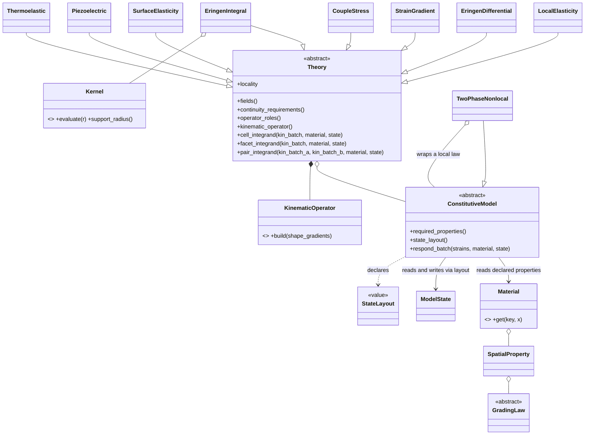
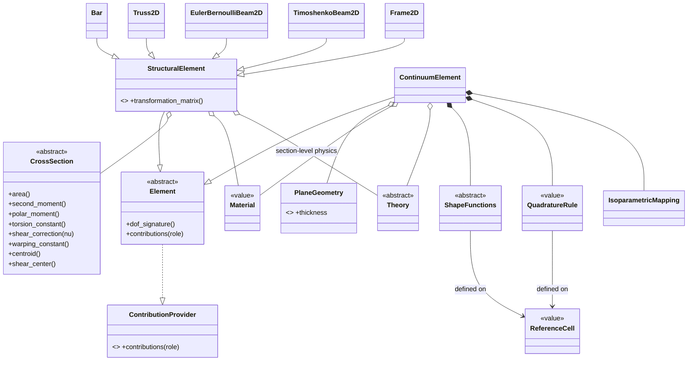
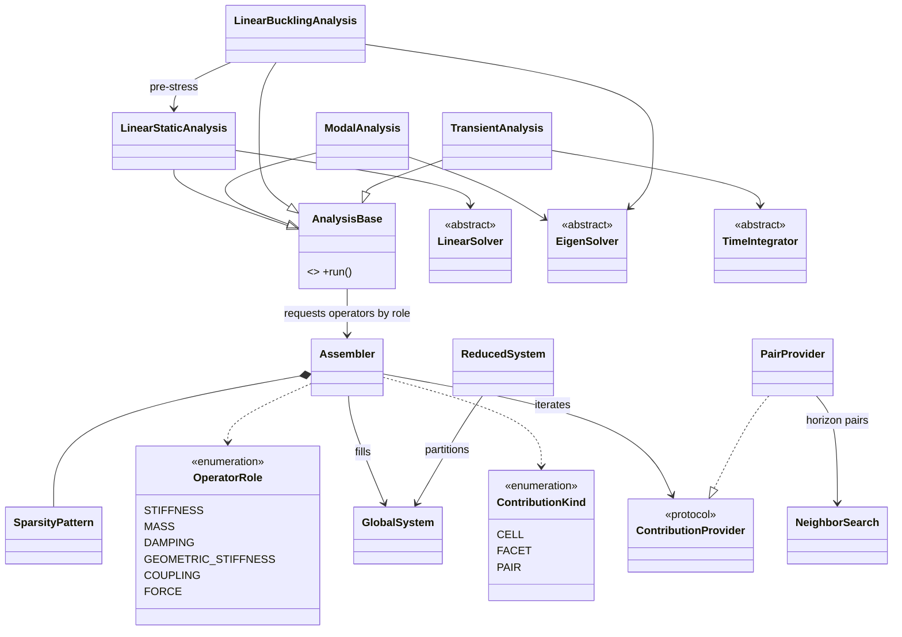
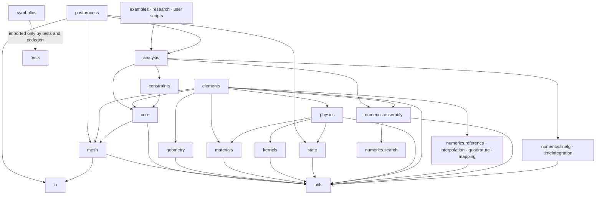

# NanoFEM — Architecture Revision 2

**Document status:** Stage-1 design deliverable, revision 2 (architecture only, no implementation)
**Supersedes:** v1 §§1–6 (architecture, folders, responsibilities, data flow, UML). v1 §§7–12 (coding standards, naming, error handling, testing, documentation, git) remain in force; the deltas they acquire are listed at the end of this document.
**Trigger:** twelve review comments aimed at turning the package from "an extensible FEM code" into "a long-term research platform" in the spirit of FEniCS / deal.II / MOOSE.

---

## Revision map: comment → architectural decision → record

| # | Review comment | Decision (short form) | ADR |
|---|---|---|---|
| 1 | Separate Material from ConstitutiveModel | `materials/` becomes pure property records; constitutive response moves to `physics/`; the two meet through an explicit *required-properties* contract | ADR-004 |
| 2 | Independent Geometry | New `geometry/` package: `CrossSection` hierarchy computing A, I, J, shear area, warping, centroid, shear center; plane thickness for continua | ADR-005 |
| 3 | Physics package | New `physics/` package, one subpackage per theory (elasticity, eringen, strain_gradient, couple_stress, surface, piezoelectric, thermoelastic); each theory owns its kinematics + constitution + weak form | ADR-006 |
| 4 | Separate numerics from mechanics | New `numerics/` umbrella: reference cells, interpolation, quadrature, mapping, assembly, linear algebra, eigen, time integration, search, math utilities; a hard "numerics never imports mechanics" rule | ADR-007 |
| 5 | Neighbor search is an algorithm | Moved `mesh/neighbor_search` → `numerics/search/` | ADR-007 |
| 6 | Kernel package | New top-level `kernels/` (plural, to avoid OS/compute-kernel ambiguity): Helmholtz family, Gaussian, bi-exponential, polynomial/cone, user-defined; normalization and boundary-truncation policies | ADR-009 |
| 7 | State variables | New `state/` package: quadrature-point state, layouts, trial/committed lifecycle with `commit()`/`revert()` — dormant in linear analyses, load-bearing for future plasticity/damage/Newton | ADR-010 |
| 8 | Physics ≠ Analysis | `analysis/` reduced to pure orchestration (static, modal, buckling, transient, optimization slot); governing equations live exclusively in `physics/`; analyses request global operators by *role* | ADR-008 |
| 9 | Dimension-independent design | `numerics/reference/` defines `ReferenceCell`s; interpolation/quadrature/mapping are cell-parameterized, never dimension-foldered; dimensions appear only as thin specializations (structural elements) | ADR-011 |
| 10 | Research package | New top-level `research/` (verification studies, benchmarks, `papers/<slug>` with lockfiles); every published figure reproducible from a pinned tag; nightly reproducibility CI | ADR-012 |
| 11 | Symbolic package | New `symbolics/` (SymPy, optional extra): independent symbolic derivation of shape functions, B operators, element matrices, nonlocal operators; used only by tests and code generation, never by runtime | ADR-013 |
| 12 | Framework ambition | Cross-cutting: contribution protocol upgraded to `{CELL, FACET, PAIR}` kinds and an `OperatorRole` vocabulary; batched-by-contract constitutive interface; optional-extras packaging | ADR-008, ADR-014 |

Two comments are adopted with a deliberate refinement rather than to the letter, with reasons given in §5: the kernel package is named `kernels/` (comment 6), and neighbor search lands in `numerics/search/` rather than a second `algorithms/` package (comment 5) so the project has exactly one home for algorithms.

---

## 1. Updated folder hierarchy

```
nanofem/
├── pyproject.toml                     # extras: nanofem[symbolic], [meshing], [viz]
├── README.md · LICENSE · CITATION.cff · CHANGELOG.md · CONTRIBUTING.md
├── .pre-commit-config.yaml
├── .github/
│   └── workflows/
│       ├── ci.yml                     # lint + typecheck + import-linter + test pyramid
│       ├── docs.yml
│       ├── release.yml
│       └── research-nightly.yml       # re-runs research/ reproducibility manifests
├── docs/
│   └── source/{tutorials, howto, theory, api, adr}/
├── examples/                          # tutorial-grade scripts (rendered by sphinx-gallery)
├── research/                          # NEW — the science lives here (ADR-012)
│   ├── verification/                  # extended studies beyond CI tolerance tests
│   ├── benchmarks/                    # performance tracking (absorbs old top-level benchmarks/)
│   ├── papers/
│   │   └── <year>_<venue>_<slug>/     # environment lockfile, inputs, run_all script, figures/
│   └── registry.md                    # index: published figure → script → version tag
├── tests/
│   ├── unit/                          # math kernels
│   ├── symbolic/                      # NEW — numeric kernels vs. independent SymPy oracles
│   ├── element/                       # invariants: symmetry, rigid-body modes, patch, locking
│   ├── verification/                  # closed-form gate (fast, CI-blocking)
│   ├── convergence/                   # h-refinement rates
│   └── regression/                    # frozen outputs
└── src/
    └── nanofem/
        ├── __init__.py                # curated public API re-exports only
        ├── core/
        │   ├── model.py               # Model facade
        │   ├── dof_handler.py         # DofHandler (multi-field, per-node variable DOFs)
        │   ├── fields.py              # FieldSpec (displacement, rotation, potential, temperature, …)
        │   └── registry.py            # Registry (plugin/factory)
        ├── mesh/
        │   ├── node.py · mesh.py      # nodes, cell blocks, regions, boundary facet tags
        │   ├── readers.py             # thin wrapper over io adapters
        │   ├── gmsh_builder.py        # lazy gmsh import
        │   └── quality.py             # Jacobian/aspect checks
        │                              # neighbor_search REMOVED → numerics/search (ADR-007)
        ├── geometry/                  # NEW (ADR-005): member & section geometry, NOT the meshed domain
        │   ├── base.py                # CrossSection ABC: area, I_y/I_z, polar moment, torsion constant,
        │   │                          #   shear area & κ(ν), warping constant, centroid, shear center
        │   ├── standard.py            # RectangularSection, CircularSection, HollowCircularSection,
        │   │                          #   HollowRectangularSection, ISection
        │   ├── custom.py              # CustomSection (validated user-supplied property table)
        │   ├── plane.py               # PlaneGeometry (thickness) for 2-D continua
        │   └── section_solver.py      # FUTURE: FEM over the section for arbitrary J, warping, shear center
        ├── materials/                 # REDEFINED (ADR-004): property records only, zero constitutive math
        │   ├── material.py            # Material — validated, typed property record
        │   ├── properties.py          # property key/unit registry; SpatialProperty (x → value)
        │   └── grading.py             # FGM laws: PowerLawGrading, ExponentialGrading, user function
        ├── physics/                   # NEW (ADR-006): every theory lives here
        │   ├── base.py                # Theory ABC · ConstitutiveModel ABC · KinematicOperator ABC ·
        │   │                          #   Locality {LOCAL, PAIRWISE} · continuity requirements
        │   ├── elasticity/            # IsotropicElasticity, OrthotropicElasticity,
        │   │                          #   PlaneStress/PlaneStrain reductions, SmallStrainOperator
        │   ├── eringen/               # differential.py (Helmholtz form) · integral.py (two-phase,
        │   │                          #   pairwise) · beam_theories.py (nonlocal EB/Timoshenko variants)
        │   ├── strain_gradient/       # gradient-enhanced kinematic operator, length-scale models
        │   ├── couple_stress/         # modified couple stress (single length scale)
        │   ├── surface/               # Gurtin–Murdoch surface elasticity (FACET contributions)
        │   ├── piezoelectric/         # coupled u–φ theory, coupling operators
        │   └── thermoelastic/         # sequential u–T first, fully coupled later
        ├── kernels/                   # NEW (ADR-009): attenuation kernels α(‖x−x′‖; ℓ)
        │   ├── base.py                # Kernel ABC: evaluate, support radius, dimension-aware normalization
        │   ├── standard.py            # Helmholtz family (bi-exponential in 1-D, Bessel-K₀ in 2-D),
        │   │                          #   GaussianKernel, ConePolynomialKernel
        │   ├── user.py                # UserKernel (validated callable wrapper)
        │   └── normalization.py       # boundary-truncation / renormalization policies
        ├── state/                     # NEW (ADR-010)
        │   ├── layout.py              # StateLayout — variables a constitutive model declares it needs
        │   ├── model_state.py         # ModelState — structure-of-arrays storage per element block
        │   ├── quadrature_state.py    # per-Gauss-point views (stress, strain, internal vars, T, history)
        │   └── history.py             # trial/committed lifecycle: commit(), revert(), snapshots
        ├── elements/                  # discretization only: geometry+interpolation meet physics
        │   ├── base.py                # Element ABC, ElementDofSignature, contribution emission
        │   ├── structural/            # bar.py, truss.py, beam_eb.py, beam_timoshenko.py, frame.py
        │   └── continuum/             # continuum.py — dimension-generic via ReferenceCell (ADR-011)
        ├── constraints/               # unchanged: dirichlet.py, loads.py, load_case.py,
        │                              #   time_functions.py, mpc.py, handler.py
        ├── numerics/                  # NEW umbrella (ADR-007): mechanics-free by import-linter contract
        │   ├── reference/             # ReferenceCell: line, triangle, quad (tet/hex named for future)
        │   ├── interpolation/         # ShapeFunctions ABC · Lagrange family · Hermite family · C⁰/C¹ tags
        │   ├── quadrature/            # QuadratureRule value objects · factory (cell × order, incl. reduced)
        │   ├── mapping/               # IsoparametricMapping
        │   ├── assembly/              # contributions.py {CELL, FACET, PAIR} · OperatorRole ·
        │   │                          #   SparsityPattern · Assembler · GlobalSystem · ReducedSystem
        │   ├── linalg/                # LinearSolver family · EigenSolver family · preconditioners
        │   ├── timeintegration/       # NewmarkBeta (Generalized-α, central difference later)
        │   ├── search/                # NeighborSearch — KD-tree horizon queries (moved from mesh/)
        │   └── math/                  # rotations, small numeric helpers
        ├── analysis/                  # orchestration ONLY (ADR-008)
        │   ├── base.py                # AnalysisBase (template method)
        │   ├── static.py · modal.py · buckling.py · transient.py
        │   ├── optimization/          # FUTURE slot: ParameterStudy, sensitivity hooks,
        │   │                          #   inverse identification of nonlocal parameters (e₀a)
        │   └── results.py             # immutable result containers
        ├── postprocess/               # recovery.py, sampling.py, diagrams.py, export.py,
        │                              #   plotting.py, pyvista_view.py
        ├── io/                        # meshio_adapter.py, writers.py
        ├── symbolics/                 # NEW (ADR-013): SymPy, optional extra, lazy import,
        │   │                          #   NEVER imported by any runtime module
        │   ├── cells.py               # independent symbolic reference cells (deliberate duplication)
        │   ├── interpolation.py       # symbolic Lagrange/Hermite shape functions
        │   ├── operators.py           # symbolic B operators, element matrices, nonlocal operators
        │   ├── integration.py         # exact integration; Gauss-rule verification
        │   └── codegen.py             # emit committed tables/expressions with provenance headers
        └── utils/                     # exceptions.py, logging.py, validation.py,
                                       #   scaling.py (Nondimensionalizer), config.py
```

Reading order for a newcomer is now: `numerics` (how we approximate) → `physics` (what we solve) → `elements` (where they meet) → `analysis` (how a run is orchestrated). That sentence goes verbatim into CONTRIBUTING.md.

---

## 2. Updated package responsibilities

| Package | Owns (single responsibility) | Must NOT do |
|---|---|---|
| `core/` | Model facade, DOF bookkeeping (multi-field, per-node variable), field specs, class registry | Compute matrices; know theory or element internals; touch files |
| `mesh/` | Domain topology & geometry data: nodes, cells, regions, boundary facet tags, quality checks | Run spatial algorithms (search moved out); know DOFs, materials, physics |
| `geometry/` | Member & section geometry: cross-section property models, plane thickness | Import `Material` (ν enters `shear_correction(ν)` as a plain number); know the mesh or elements |
| `materials/` | Validated property records; spatial property variation (FGM grading laws) | Compute stress or tangent; know strain measures or element types |
| `physics/` | The theories: kinematic operators (generalized strains), constitutive models, weak-form integrands, operator roles, locality, continuity requirements | Own DOF numbering; loop over quadrature; store global operators; import discretization |
| `kernels/` | Attenuation functions of distance: evaluation, support radius, normalization, boundary-truncation policies | Know meshes, elements, or materials — kernels are pure functions of r and parameters |
| `state/` | Storage and lifecycle of quadrature-point variables: layouts, trial/committed, snapshots | Interpret variables (meaning belongs to physics); allocate for models whose laws declare no state |
| `elements/` | Compose numerics (interpolation, quadrature, mapping) with physics, geometry, and materials into contribution providers | Assemble globally; apply BCs; implement constitutive math or solvers |
| `constraints/` | BC/load/MPC descriptions, load cases, time functions, DOF partitioning | Modify global matrices directly |
| `numerics/` | Approximation & algebra: reference cells, interpolation, quadrature, mapping, assembly scatter, sparsity, linear/eigen solvers, time integration, spatial search, math helpers | Import **any** mechanics package (hard import-linter contract); know what operators mean physically |
| `analysis/` | Orchestration of run types; request operators by role; chain runs (buckling); package results | Contain physics formulas or numerical kernels |
| `postprocess/` | Derived fields, sampling, member diagrams, export, plotting, interactive views | Mutate model, solution, or state |
| `io/` | External format conversion (meshio, VTK/XDMF) | Contain physics; be imported by the core |
| `symbolics/` | Independent symbolic derivations, test oracles, code generation with provenance | Be imported by any runtime module; share code with `numerics/` (independence is the point) |
| `utils/` | Exceptions, logging, validation, nondimensional scaling, config | Import anything else in the package |
| `research/` (repo level) | Reproducibility of published science: studies, benchmarks, per-paper manifests | Gate per-PR CI (nightly only) |
| `tests/`, `docs/`, `examples/` | As in v1 (§10, §11), plus `tests/symbolic/` | — |

---

## 3. Updated UML architecture

### 3.1 Physics core: theory, constitution, materials, kernels, state



The decorator at the bottom is deliberate: the two-phase Eringen constitutive *wraps* any local law (isotropic, orthotropic, graded), so nonlocality composes with the whole local catalogue instead of duplicating it.

### 3.2 Discretization seam: elements compose numerics, physics, geometry, materials



Note what changed since v1: `SmallStrainOperator` no longer appears here — kinematic operators belong to their `Theory` (§5, D-3). Structural elements hold a `CrossSection` instead of raw floats, and accept a section-level `Theory` so nonlocal beam variants (phase 4a) are *the same elements with different physics injected*, not new element classes.

### 3.3 System seam: roles, kinds, assembly, analyses



---

## 4. Updated dependency graph



Three rules, all enforced as import-linter contracts in CI, replace v1's single dependency rule:

**R1 — Numerics is mechanics-free.** No module under `numerics/` imports `mesh`, `geometry`, `materials`, `physics`, `elements`, `constraints`, or `analysis`. The `ContributionProvider` protocol is defined in `numerics/assembly` and *implemented* by mechanics — arrows point from mechanics into numerics, never back.

**R2 — Physics is discretization-free.** `physics/` never imports interpolation, quadrature, mapping, or elements. Theories receive evaluated kinematic batches (shape values, gradients, coordinates, as plain arrays) and return integrand blocks. Consequence: every theory is unit-testable without a mesh.

**R3 — Edges stay thin.** `io/` and `symbolics/` are never imported by runtime core packages; `gmsh`, `pyvista`, `sympy` are lazy imports behind the `[meshing]`, `[viz]`, `[symbolic]` extras. A runtime import of `symbolics` is a CI failure by construction.

The pairwise nonlocal path reads directly off the graph: `physics.eringen` uses `kernels` for α(r), the pair provider in `elements` asks `numerics.search` for horizon pairs through the assembly layer, and nothing above `numerics.assembly` can tell the difference.

---

## 5. Explanation of every major design decision

### D-1 — Material vs. ConstitutiveModel (comment 1, ADR-004)

`Material` becomes a validated, typed property record: E, ν, ρ, thermal expansion α, damping loss factor, piezoelectric and dielectric constants, and material length scales (e₀a, strain-gradient ℓ, couple-stress ℓ) — parameters are data, and they all live in one place. Any property may be a `SpatialProperty` (position → value), which is the whole FGM story: a functionally graded material is *not a class*, it is an ordinary `Material` whose properties carry `PowerLawGrading` or `ExponentialGrading` laws. The constitutive side moves to `physics/`: each `ConstitutiveModel` declares `required_properties()`, and the `Model` facade validates law↔material compatibility at setup — "EringenIntegral requires property 'e0a'; material 'silicon_100' does not define it" — extending v1's fail-fast policy (§9) to physical consistency. The performance-critical clause: the constitutive contract is **batched by default**. `respond_batch` receives arrays spanning all quadrature points of an element block and returns arrays; no law is ever called point-at-a-time. This one signature decision keeps the new indirection chain (Element → Theory → ConstitutiveModel → Material → State) out of Python's innermost loop, and is the difference between an elegant architecture and an unusably slow one.

### D-2 — Independent Geometry (comment 2, ADR-005)

Adopted, with a scope disambiguation stated in the package docstring: `geometry/` is *member and section* geometry; the meshed domain remains `mesh/`'s business. The `CrossSection` contract computes area, second moments about both axes, centroid, shear center, shear area with κ(ν), warping constant — and it distinguishes **polar moment from torsion constant**, which coincide only for circular sections; conflating them is a classic frame-code bug that this API makes structurally impossible. The κ(ν) subtlety (Cowper's shear correction depends on Poisson's ratio) is resolved without coupling: `shear_correction(ν)` takes a plain float, so `geometry/` never imports `materials/`. Standard shapes use closed forms now; `CustomSection` accepts a validated user-supplied property table; and computing J, warping, and shear center for *arbitrary* sections — which requires solving Saint-Venant problems over a meshed cross-section — is explicitly fenced as a future `section_solver`, because it is a small FEM project in its own right. Elements hold a `CrossSection`, never raw A and I; 2-D continua hold a `PlaneGeometry` carrying thickness.

### D-3 — The physics package (comment 3, ADR-006)

`physics/` absorbs v1's `formulations/` and the constitutive half of the old `materials/`. The interface work is what matters: a `Theory` declares (a) the **fields** it needs (displacement; rotation; electric potential; temperature), (b) its **continuity requirements** — C⁰ or C¹, validated against the chosen interpolation at model build, so StrainGradient + Lagrange fails fast with a clear message, (c) the **operator roles** it can produce, (d) its **locality** (LOCAL or PAIRWISE), (e) its **kinematic operator** — the generalized strain definition, which is why `SmallStrainOperator` moved out of `elements/`: small strain, gradient-enhanced strain, curvature (couple stress), and surface strain are theory statements, not discretization machinery — and (f) integrand builders per contribution kind. Two entries in the subpackage list quietly forced protocol upgrades, and that is exactly why they were added now: **surface elasticity** (Gurtin–Murdoch) contributes membrane stiffness on boundary *facets*, forcing the FACET contribution kind; **piezoelectricity** contributes K_uφ blocks, forcing the COUPLING operator role and exercising the multi-field DofHandler that v1's D3 already built. Voltage BCs cost zero new constraint code because `DirichletBC` was always (field, component)-generic. Thermoelasticity enters sequentially first (temperature as state feeding thermal strain), fully coupled later.

### D-4 — Numerics separated from mechanics (comment 4, ADR-007)

What moved: interpolation, quadrature, and mapping out of `elements/`; assembly, sparsity, and system containers out of the old `assembly/`; linear, eigen, and time-integration solvers out of the old `solvers/`; rotations out of `utils/`. What holds it together is rule R1: `numerics/` imports nothing from mechanics, enforced by import-linter in CI, so it is independently testable, reusable, and the single swap point if a compiled or GPU backend ever arrives — that future ADR would touch one package. The `ContributionProvider` protocol lives in `numerics/assembly` because it is the assembler's *input contract*; mechanics implements it, and dependency arrows point from mechanics into numerics, never back.

### D-5 — Neighbor search relocation (comment 5, folded into ADR-007)

Adopted, with one refinement: `numerics/search/` rather than a new `algorithms/` package, so the project has exactly one home for algorithms and the import rules stay binary (mechanics vs. numerics). The dividing line generalizes cleanly: `mesh/` owns data and integrity checks; anything that answers a question by *computation over* that data is numerics.

### D-6 — The kernels package (comment 6, ADR-009)

Adopted as top-level `kernels/` — plural, to avoid collision with the "compute kernel"/OS-kernel senses of the word. Beyond the requested catalogue (Helmholtz family, Gaussian, bi-exponential, polynomial/cone, user-defined), the design records two facts the literature is casual about. First, kernels are **dimension-aware**: the Green's function of the Helmholtz operator is the bi-exponential in 1-D but Bessel-K₀ in 2-D — one conceptual kernel, per-dimension realizations, so "bi-exponential" and "Helmholtz" are not independent entries but the same family. Second, the normalization ∫α dV = 1 **fails near boundaries** when the horizon is truncated; whether to renormalize or to let the two-phase model absorb the deficit is a modeling decision, so `normalization.py` makes it an explicit policy object rather than a hidden default — v1's "no silent defaulting" applied to physics. Kernels are pure functions of distance and parameters, ignorant of meshes and elements, which is precisely why `UserKernel` is safe to accept from third parties.

### D-7 — State variables (comment 7, ADR-010)

Each `ConstitutiveModel` declares a `StateLayout` (linear elasticity: empty; future plasticity: εᵖ and hardening variables; damage: d; thermoelasticity: T). `ModelState` allocates structure-of-arrays storage per element block *only for what layouts request*, so linear analyses pay zero memory. The lifecycle — trial state, `commit()` on convergence, `revert()` on divergence, snapshots for time stepping — is designed now because retrofitting it later would change every constitutive signature in the package: Newton iterations are the consumer this API is shaped for. The immediate (not merely future) payoff: temperature-as-state gives sequential thermoelasticity a home, and post-processing reads recovered stresses through the same state views, unifying linear and nonlinear result paths.

### D-8 — Physics separated from analysis, plus the role vocabulary (comment 8, ADR-008)

Analyses no longer know any formulas. They request global operators by `OperatorRole` — STIFFNESS, MASS, DAMPING, GEOMETRIC_STIFFNESS, COUPLING(field_i, field_j), FORCE — and hand them to `numerics/`. Which roles exist for a given model is answered by its theories, not by the analysis. Combined with `ContributionKind` {CELL, FACET, PAIR}, this is the v2 upgrade of v1's load-bearing Decision D1: the same protocol idea, now a small closed vocabulary that absorbs surface physics and multiphysics coupling with an *unchanged assembler*. `analysis/optimization/` gets its named slot as pure orchestration over repeated analyses — parameter sweeps, sensitivity hooks, and the research motivation behind it: inverse identification of e₀a and length-scale parameters against MD or experimental data.

### D-9 — Dimension-independent design (comment 9, ADR-011)

`numerics/reference/` defines `ReferenceCell` value objects (line, triangle, quad; tet and hex named for the future). Interpolation, quadrature, and mapping are parameterized by cell, never foldered by dimension, and `ContinuumElement` is one class for any cell — adding 3-D solids later means adding reference cells and shape families, not touching a single element. Dimensions survive only where mechanics is genuinely dimension-typed: `Truss2D` versus a future `Truss3D` differ in transformation matrix and DOF signature, nothing else — which is exactly the "dimensions as specializations" clause of the comment, and consistent with the honest hybrid of ADR-002.

### D-10 — The research package (comment 10, ADR-012)

The distinction that keeps both halves healthy: `tests/` answers *"is the code correct"* in seconds and blocks every merge; `research/` answers *"is the science reproducible"* in minutes-to-hours and blocks nothing per-PR. Each `research/papers/<year>_<venue>_<slug>/` pins an environment lockfile, a released nanofem version tag, input data, a single `run_all` entry point, and the expected figures; `registry.md` maps every published figure to its (script, tag) pair. A nightly workflow re-executes the manifests and opens an issue on drift, and releases used in papers are archived with a DOI (Zenodo) so citations resolve indefinitely. This folder is the operational meaning of "research platform."

### D-11 — The symbolics package (comment 11, ADR-013)

Two sanctioned uses. As **test oracles**: `tests/symbolic/` compares numerical kernels against independently derived SymPy expressions at random evaluation points — Hermite shape functions, B operators, closed-form beam matrices, and later the nonlocal operators where hand derivation is genuinely error-prone. As **code generation**: derived tables are emitted as plain numpy source, committed with provenance headers naming the generating script, so the runtime never depends on sympy. The comment's independence requirement is strengthened into a principle: `symbolics/` shares *no code* with runtime numerics — the duplication (its own symbolic reference cells) is deliberate, because a verification path that reuses the implementation under test verifies nothing. SymPy ships as the `[symbolic]` extra; a runtime import of `symbolics` is a CI failure.

### D-12 — Framework ambition, made mechanical (comment 12, ADR-014)

Three cross-cutting moves operationalize "FEniCS/deal.II/MOOSE in spirit." Optional-extras packaging formalizes v1's P5: the core install is numpy + scipy + matplotlib + meshio; `[meshing]` adds gmsh, `[viz]` adds pyvista, `[symbolic]` adds sympy. The `Registry` + entry-points plugin path now covers more registerable kinds: theories, constitutive models, kernels, and cross-sections, not just elements and solvers. And the measurable claim from v1 is restated, stronger: every roadmap phase — now including surface elasticity and piezoelectricity, which v1 could *not* have absorbed without assembler surgery — lands as a new subpackage with zero edits to existing interfaces, and each phase's PR review audits exactly that.

---

## 6. Advantages compared to the previous architecture

**The extension axis is now a single documented seam.** In v1, adding nonlocal or strain-gradient elasticity was clean, but surface elasticity (boundary integrals) and piezoelectricity (coupled fields) would have required assembler and interface surgery. With `ContributionKind` and `OperatorRole`, *every* theory in the ten-year plan — and user-defined theories via the registry — arrives through the same door: one `physics/` subpackage.

**Materials became data, and physical nonsense became a setup-time error.** Property records with declared requirements mean a law missing its length scale, or an FGM grading applied to a property the law never reads, is caught before assembly with a message naming the property and the material. FGM stopped being a special class and became a property annotation, so it composes with every present and future law for free — including the two-phase nonlocal decorator, giving graded nonlocal beams (a live research topic) by composition alone.

**Section engineering is decoupled from element code.** Section libraries can grow, users can supply measured section properties, and an arbitrary-section solver can arrive later — all without touching one element. The torsion-constant/polar-moment distinction is now enforced by the API rather than by reviewer vigilance.

**Verification gained a second, independent path, and publication gained a reproducibility contract.** Symbolic oracles catch derivation errors that closed-form verification can miss (a wrong B matrix can still pass a patch test in special configurations); `research/` makes every published figure a build artifact with a pinned environment. These two are precisely what referees and JOSS reviewers probe hardest.

**Numerics consolidation creates one testable, swappable core.** Assembly, solvers, search, interpolation, and quadrature now share utilities instead of duplicating them, are tested without any mechanics fixtures, and constitute the single package a future performance backend would replace.

**Nonlinearity stops being a cliff.** With state lifecycle, batched constitutive signatures, and role-keyed assembly in place from phase 0, phase 7 (Newton, arc-length) changes constitutive *internals* and adds solvers — it does not change signatures that fifty call sites already depend on.

---

## 7. Possible drawbacks

| Drawback | Why it is real | Mitigation |
|---|---|---|
| Package count roughly doubles; onboarding cost rises | A newcomer must locate the right seam among core/mesh/geometry/materials/physics/kernels/state/elements/numerics/… | The one-sentence reading order in §1 goes into CONTRIBUTING.md; import-linter contracts make the structure self-teaching; docs get an architecture map page |
| Deeper indirection: Element → Theory → ConstitutiveModel → Material → State | Python-level call overhead in the hottest loop of the program | Batched-by-contract constitutive API (arrays per element block, never per point); per-run binding/precomputation of property lookups; v1's profile-before-optimizing policy stands |
| Speculative generality: FACET/PAIR kinds, state lifecycle, optimization slot exist before their second consumer | Interfaces designed without a consumer tend to be wrong in the details | Phase-0 walking skeleton drives `Bar` through *every* layer to validate the seams; ADR revisit rule: any interface still unused after two phases is formally re-examined |
| `geometry/` name collides mentally with domain geometry | Genuine ambiguity for newcomers | Scope note in the package docstring and in §2; `mesh/` docstring explicitly disclaims sections |
| Section-solver scope creep | Warping constants and shear centers of arbitrary sections require a Saint-Venant FEM solve — a project in itself | Explicitly future-fenced behind `CustomSection`, which covers the gap with user-supplied values |
| Symbolic/numeric duplication must be maintained in parallel | Two derivations of the same mathematics | That duplication *is* the feature: divergence between the two paths is a caught bug, not drift — but the cost is acknowledged and confined to the `[symbolic]` extra |
| `research/` can rot as the code evolves | Published-figure scripts break silently against new versions | Nightly reproducibility workflow + pinned lockfiles + archived (DOI) tags; drift files an issue automatically |
| Physics tree looks aspirational until phases 4–6 | Several subpackages hold only theory-manual references for a year or more | Accepted deliberately: the tree *is* the roadmap, and empty subpackages carry references, not dead code |
| Coupled-field theories stress the solver story | Piezo/thermo produce block-structured, sometimes indefinite systems beyond plain SPD solves | Contained by design in `numerics/linalg`; documented as the explicit phase gate for those theories rather than discovered mid-implementation |

The honest summary of the trade: v2 spends *structure* today to buy *invariance* tomorrow. For a weekend script that trade is wrong; for a platform intended to outlive several papers and several contributors, it is the only trade that works — provided the phase-0 walking skeleton is built promptly, so every seam is validated by running code before the abstractions calcify.

---

## What this revision deliberately does not change

Layered architecture with downward-only imports (now three explicit rules, R1–R3); contribution-based assembly as the load-bearing idea (extended by kinds and roles, not replaced); coding standards, naming conventions, and the error hierarchy of v1 §§7–9 (the exception tree gains `PhysicsError` with `IncompatibleContinuityError` and `MissingPropertyError`); the five-level test pyramid of v1 §10 (which gains `tests/symbolic/` between unit and element levels, and the research nightly *outside* the pyramid); Diátaxis documentation, with the theory manual now mapping one-to-one onto `physics/` subpackages; the GitHub-Flow git workflow, whose PR checklist gains two boxes — "import-linter green" and "research manifest updated if `research/` touched." Roadmap phases keep their numbering and their "existing interfaces touched: **none**" audit column; phases 4–6 now name their exact landing subpackages under `physics/`.

*End of revision 2. Stage 2 (on request): the phase-0 walking skeleton — package stubs honoring R1–R3, import-linter contracts, CI configuration, and the first failing verification test (a bar under end load) that exercises every seam in this document.*
