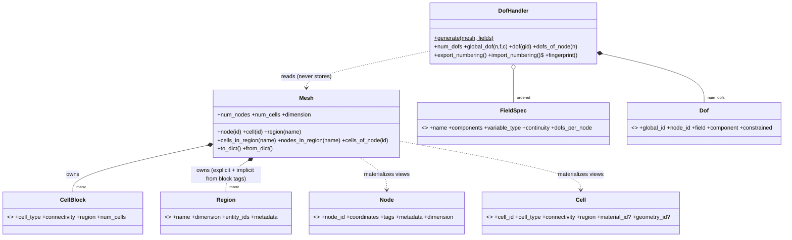

# NanoFEM Phase-1 Object Model

**Status:** implemented and tested (v0.1.0). Companion to ARCHITECTURE_v2.md and the SDS; where
those documents are normative, this one records how the phase-1 *data layer* realizes them.
Zero finite element mathematics exists anywhere in this layer: no matrices, no weak forms, no
quadrature, no constitutive equations. Everything below is data, declarations, validation,
bookkeeping, and serialization.

The first real mathematics built on top of this layer - a bar element, assembled, constrained,
and solved - is WALKING_SKELETON.md (v0.8.0); it also records the five read-only `Model`
accessors that phase added.

---

## 1. Folder placement of the sixteen requirement items

| # | Requirement | Class(es) | Module |
|---|---|---|---|
| 1 | Node | `Node` | `mesh/node.py` |
| 2 | Cell | `CellBlock` (storage), `Cell` (per-entity view) | `mesh/mesh.py` |
| 3 | Mesh | `Mesh` | `mesh/mesh.py` |
| 4 | Region | `Region` | `mesh/region.py` |
| 5 | FieldSpec | `FieldSpec`, `VariableType`, factories | `core/fields.py` |
| 6 | DOF | `Dof` | `core/dof_handler.py` |
| 7 | DOFHandler | `DofHandler` | `core/dof_handler.py` |
| 8 | Material | `Material` (+ `materials/properties.py`, grading placeholders) | `materials/material.py` |
| 9 | Section geometry | `RectangularSection`, `CircularSection`, `HollowCircularSection`, `HollowRectangularSection`, `ISection`, `CustomSection` | `geometry/standard.py`, `geometry/custom.py` |
| 10 | Theory | `Theory` (ABC), `TheoryDeclaration`, `DeclaredTheory`, `Locality` | `physics/base.py` |
| 11 | ConstitutiveModel | `ConstitutiveModel` (ABC), `ConstitutiveDeclaration` | `physics/base.py` |
| 12 | State | `StateLayout`, `ModelState`, `StateHistory`, `QuadraturePointState` | `state/` |
| 13 | Boundary conditions | `DirichletBC`, `NeumannBC`, `RobinBC`, `MultiPointConstraint` | `constraints/` |
| 14 | Loads | `NodalLoad`, `LineLoad`, `TractionLoad`, `BodyForce`, `LoadCase`, `TimeFunction` family | `constraints/loads.py`, `load_case.py`, `time_functions.py` |
| 15 | Analysis | `AnalysisBase` + `LinearStaticAnalysis`, `ModalAnalysis`, `LinearBucklingAnalysis`, `TransientAnalysis` with frozen `*Options` | `analysis/` |
| 16 | Model | `Model`, `DomainDefinition` | `core/model.py` |

Supporting vocabulary (not requirement items, but load-bearing): `ContributionKind` /
`OperatorRole` (`numerics/assembly/contributions.py`), `Continuity` + `OPERATOR_CATALOG` +
`derived_continuity` (`numerics/operators/base.py`), `ReferenceCell` registry
(`numerics/reference/cell.py`), validation preconditions (`utils/validation.py`), array payload
helpers (`utils/serialize.py`).

---

## 2. Class diagrams

### 2.1 Mesh and core data model



`CellBlock` is the authoritative structure-of-arrays storage (SDS C-8); `Node` and `Cell` are
per-entity *record views* materialized on demand. Global cell ids run block-by-block in
declaration order, which is what makes numbering deterministic (SDS C-5).

### 2.2 Declarations, model facade, and analyses

```mermaid
classDiagram
    class Theory { <<abstract>> +fields() +continuity_requirements() +required_properties() +required_state() +operators_used() +operator_roles() +contribution_kinds() +locality() }
    class TheoryDeclaration { <<frozen dataclass>> +name +field_requirements +continuity +required_properties +required_state +operators +roles +kinds +locality }
    class DeclaredTheory { +declaration }
    class ConstitutiveModel { <<abstract>> +required_properties() +state_layout() +response_components() +respond_batch() }
    class ConstitutiveDeclaration { <<frozen dataclass>> }
    class Material { +name +keys +defines(k) +value(k) +value_at(k,T) +to_dict() +from_dict()$ }
    class CrossSection { <<abstract>> +area() +second_moment_z() +... }
    class StateLayout { <<frozen dataclass>> +variables }
    class ModelState { +allocate(layout,n_cells,n_qp) +view(name) +committed_view(name) +commit() +revert() }
    class StateHistory { +snapshot() +restore() +checkpoint(path) [TODO] }
    class DomainDefinition { <<frozen dataclass>> +name +region +theory +material +geometry? }
    class Model {
        +add_material() +add_section() +add_theory() +add_domain()
        +add_dirichlet() +add_neumann() +add_robin() +add_constraint() +add_load_case()
        +field_specs() +validate() +build_dof_handler()
        +to_manifest() +fingerprint()
    }
    class AnalysisBase { <<abstract>> +model +required_roles() +validate() +describe() +run() [raises] }
    class LinearStaticAnalysis
    class ModalAnalysis
    class LinearBucklingAnalysis
    class TransientAnalysis

    DeclaredTheory --|> Theory
    DeclaredTheory *-- TheoryDeclaration
    Model *-- Mesh : owns
    Model o-- "by name" Material
    Model o-- "by name" Theory
    Model o-- "by name" CrossSection
    Model *-- "many" DomainDefinition
    Model o-- "many" DirichletBC
    Model o-- "many" LoadCase
    ModelState *-- StateLayout : allocated from
    StateHistory o-- ModelState
    AnalysisBase o-- Model : borrows, never mutates
    LinearStaticAnalysis --|> AnalysisBase
    ModalAnalysis --|> AnalysisBase
    LinearBucklingAnalysis --|> AnalysisBase
    TransientAnalysis --|> AnalysisBase
```



---

## 3. Relationship semantics (inheritance vs composition, in prose)

**Ownership (composition).** `Model` owns its `Mesh` and its `DomainDefinition` records — their
lifetimes are the model's. `Mesh` owns its blocks and regions and freezes them. `ModelState`
owns its trial/committed banks. `DeclaredTheory` owns its declaration record.

**Shared reference (aggregation).** Materials, sections, and theories are registered *by name*
and may be shared across domains; they are stateless records in phase 1, so sharing is safe.
`StateHistory` and `QuadraturePointState` hold references to a `ModelState` they do not own.

**Borrowing.** An `Analysis` borrows the `Model` read-only: `validate()` and `describe()` never
mutate it, and `run()` refuses to execute in phase 1 (`NotImplementedError`), which is the
mechanical proof that orchestration metadata and solving are separate concerns.

**Inheritance is used only where the domain is taxonomic** (P2 of the architecture): the
`Theory`, `ConstitutiveModel`, `CrossSection`, `TimeFunction`, and `AnalysisBase` families.
Everything else is a frozen dataclass composed into containers. `DeclaredTheory` is the bridge
pattern instance: a concrete `Theory` whose behavior *is* its data, so the object model can be
exercised end to end before any physics exists.

**The binding decision (dev note N-8).** Region-level binding via `DomainDefinition`
(region -> theory + material + optional section) is canonical. `Cell.material_id` /
`Cell.geometry_id` exist as optional convenience tags on the view object, mirroring how
deal.II separates the triangulation from DoF/material assignment. Nothing in DOF numbering or
validation reads the per-cell tags.

---

## 4. Serialization strategy

One uniform convention across the layer:

1. Every serializable object implements `to_dict() -> dict[str, object]` producing a
   **JSON-compatible** payload, and a `from_dict()` classmethod that inverts it exactly.
   Arrays are encoded with explicit dtype and shape (`utils/serialize.py`) so SDS C-4 types
   survive round trips.
2. **Objects produce payloads; only `io/` touches files** (rule R3). Nothing in the physics
   core imports `io`.
3. `Model.to_manifest()` emits the declarative record of the whole model under a versioned
   schema key (`"nanofem-model/1"`), with dict entries sorted for determinism.
4. `Model.fingerprint()` and `DofHandler.fingerprint()` are SHA-256 digests of the canonical
   JSON payloads — the phase-1 realization of the SDS Section 7 restart contract. Tests assert
   fingerprints are stable across rebuilds and change when content changes.
5. `DofHandler.export_numbering()` / `import_numbering()` round-trip the *numbering itself*,
   including per-field `VariableType` and `Continuity` (a phase-1 defect found and fixed by
   the unit tests — see dev note N-9), so a restarted run can prove it is using the same
   equation ordering.

What is deliberately **not** serialized in phase 1: theories (referenced by name in the
manifest; declaration serialization arrives when the plugin conformance kit needs it),
sections beyond their names, and state banks (checkpointing is a placeholder that raises).

---

## 5. Validation rules (fail fast, with mechanics context)

All constructor-time checks raise `InputValidationError` (or a domain subclass) naming the
offending value. Nothing is silently defaulted, dropped, or repaired.

| Object | Rules enforced at construction |
|---|---|
| `Node` | id ≥ 0; coordinates 1-D, length 1..3, finite; array frozen read-only |
| `CellBlock` | identifiers non-empty; connectivity (n_cells, n_en) int64, non-negative; frozen |
| `Mesh` | coords (n, d), d in 1..3, finite; **no duplicate coordinates**; connectivity in range; **no orphan nodes**; unique region names; region entity ids in range; node (dim 0) and cell (dim = mesh dim) regions only in phase 1 |
| `Region` | dimension 0..3; entity ids non-empty, unique, non-negative |
| `FieldSpec` | components non-empty, unique identifiers |
| `Material` | canonical-key bounds: E, G > 0; **ν in open (-1, 0.5)** — auxetics welcome by design; ρ, e0a, l_sg, l_cs, ρ_s ≥ 0; μ_s, λ_s, τ0 finite (negative μ_s legal, Miller–Shenoy); unknown bare keys rejected listing the canonical set; user keys must be namespaced `group.key`; if E, ν, G all given, **G = E/(2(1+ν))** consistency is enforced (SDS §6) |
| Sections | dimensions positive (hollow: inner < outer, thickness fits); property *computation* raises `NotImplementedError` until phase 2 |
| `TheoryDeclaration` | ≥ 1 field; unique field names; component counts ≥ 1; continuity keys name declared fields; operators ⊆ `OPERATOR_CATALOG` (SDS §8); roles/kinds non-empty; **PAIRWISE locality ⟺ PAIR kind** |
| `ConstitutiveDeclaration` | response_components ≥ 1 |
| `ModelState` | single allocation; unknown variable names raise `StateError`; empty layout allocates nothing |
| BCs / loads | identifiers non-empty; vectors 1-D and finite; Robin coefficient ≥ 0; MPC masters/coefficients aligned and non-empty |
| `*Options` | num_modes ≥ 1; t_end, dt > 0; dt ≤ t_end; preload_case named |
| `Model.validate()` | ≥ 1 domain; domain regions are cell regions; theory/material/section names resolve; **every theory-required property is defined by the bound material** (`MissingPropertyError`, names both sides); field merging rejects conflicting component counts; BC regions exist; BC fields are declared; BC components exist on the field |

`Model.build_dof_handler()` runs `validate()` first: a numbered model is a validated model.

---

## 6. Example instantiation

`examples/ex01_object_model.py` is the executable success criterion — Mesh → Material →
Theory → FieldSpec → Model → Analysis with nothing solved. Condensed:

```python
mesh = Mesh(coords, (CellBlock("quad4", conn, "body"),),
            (Region("left", 0, (0, 3)), Region("tip", 0, (2, 5))))
model = Model(mesh)
model.add_material(Material("silicon", E=169.0e9, nu=0.22, rho=2330.0))
model.add_theory("local_elasticity", DeclaredTheory(TheoryDeclaration(...)))
model.add_domain(DomainDefinition("plate", "body", "local_elasticity", "silicon"))
model.add_dirichlet(DirichletBC("left", "u", ("x", "y"), 0.0))
model.validate()
dof_handler = model.build_dof_handler()      # 12 DOFs, deterministic
ModalAnalysis(model, ModalOptions(num_modes=6)).describe()   # metadata only
```

Fields are **materialized, not declared twice**: `Model.field_specs()` computes the union of
theory field requirements (dev note N-4), so the `FieldSpec` step of the chain is derived —
the user cannot desynchronize fields from theories.

---

## 7. Test coverage of this layer

`tests/unit/` holds the executable specification: validation preconditions; mesh integrity,
immutability, queries, round trips; deterministic C-2 numbering and numbering round trips;
material bounds (including the auxetic and Miller–Shenoy cases) and the G-consistency check;
declaration cross-checks including the Eringen-integral PAIRWISE shape; the state
trial/commit/revert lifecycle; BC/load/MPC data validation; and the full model chain with
every fail-fast branch exercised. 136 tests pass; the phase-0 architecture contracts
(import-linter) remain green.
